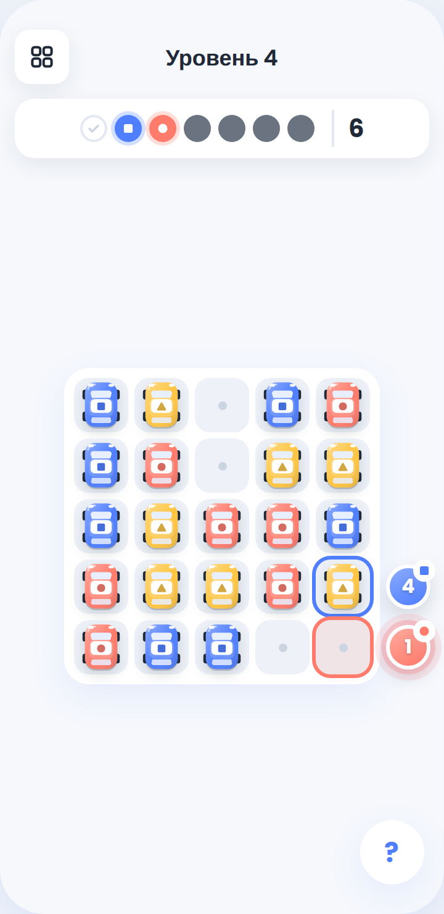

# 1. Граница прототипа

**Что проверяем.** Переставляет ли игрок такси «не того» цвета, чтобы подвести
пустую клетку к более срочному маршруту, когда несколько пассажиров ждут
одновременно и терпение тратится с каждым сдвигом.

**Минимальный цикл.** Поле `5×5`, 17–21 такси в одну клетку трёх цветов, 4–8
пустых клеток, пассажиры снаружи у краёв, терпение по ходам, свайп на одну
клетку, немедленный выезд совпавшего такси. Такси больше, чем пассажиров:
лишние остаются на поле помехами, и их приходится переставлять.

**Не делаем.** Генерацию уровней во время игры, другие размеры поля,
препятствия, специальные такси, повороты, бустеры, кнопку «пропустить ход».

**Уровней четыре:** 3, 4, 5 и 7 пассажиров.

**Отступления от шаблона — решения автора от 2026-09-22**, принятые после
первой игры в срез («очень сложно»):

- **Есть отмена хода, «заново» и «к уровням».** Шаблон отмену запрещает,
  потому что она снимает цену решения. Здесь цена — терпение, и отмена
  позволяет откатывать ход за ходом. Поэтому число отмен пишется в лог (§8) и
  смотрится на Gate 2 рядом с kill-критерием.
- **Уровней четыре, а не пять.** Уровень на 10 пассажиров генератор за
  разумное время не нашёл; автор решил, что хватит четырёх.
- **Победа — «все пассажиры развезены», а не «поле пустое».** При 3
  пассажирах и 17 такси очистить поле невозможно. Лишние такси и есть то,
  ради чего существует механика: kill-критерий спрашивает, приходится ли
  двигать чужой цвет.

**Почему kill-критерий такой.** Он проверяет центральную перестановку «не
моего» цвета. Если уровни проходятся прямым движением целевых такси, дело не
в балансе отдельной раскладки: заявленного пятнашечного решения просто нет.

**OPEN — kill-критерий и число уровней.** Владелец: автор. Критерий записан
на пять уровней («четыре из пяти»), а в прототипе их четыре. Сейчас его можно
прочитать двояко: «все четыре» или «не выполнимо никогда». Надо либо вернуть
пятый уровень, либо переписать критерий. Переписать его после первых цифр
может только автор, и причину надо записать здесь же.

# 2. Цель и основной цикл

Цель игрока — развезти всех пассажиров уровня. Такси без пассажира остаются
на поле.

Первое доступное действие — свайпнуть такси в сторону соседней пустой клетки.

```text
Увидеть цвет, место посадки и терпение ожидающих пассажиров
→ свайпнуть такси на одну соседнюю пустую клетку
→ при совпадении цвета с пассажиром у этой клетки такси уезжает, клетка пустеет
→ терпение остальных ожидающих уменьшается на 1
→ появляются пассажиры, чья очередь наступила
→ проверка победы и поражения по §5
```

# 3. Объекты и состояние

| Объект | Состояния | Изменения | Ограничения |
|---|---|---|---|
| Клетка | занята такси; пустая | освобождается при сдвиге или выезде такси; занимается при сдвиге | не больше одного такси в клетке |
| Такси | на поле; уехало | сдвигается в соседнюю пустую клетку; уезжает при посадке | занимает одну клетку; везёт одного пассажира; цвет не меняется |
| Пассажир | в очереди; ждёт; обслужен; ушёл | появляется, когда обслужено `unlockAfterServed` пассажиров; теряет терпение после каждого валидного сдвига | стоит снаружи поля напротив одной краевой клетки; два пассажира уровня не делят одну клетку |
| Место посадки | — | — | краевая клетка напротив пассажира; для такси это обычная клетка, пассажир движение не блокирует |

**Пространство** — ортогональная сетка `5×5`. Клетка адресуется парой
`row = 0..4` (сверху вниз) и `col = 0..4` (слева направо). Соседние клетки —
на манхэттенском расстоянии `1`, диагональ соседством не считается. Место
посадки — сторона поля (`top`, `right`, `bottom`, `left`) и индекс клетки
вдоль неё `0..4`, слева направо или сверху вниз.

**Состав уровня.**

- Такси 17–21, пустых клеток 4–8, вместе 25.
- Цвета такси делятся почти поровну: разница между цветами не больше одного.
- Такси каждого цвета не меньше, чем пассажиров этого цвета.

```ts
type Color = 'red' | 'blue' | 'yellow';
type Index = 0 | 1 | 2 | 3 | 4;

type TaxiState = { id: string; color: Color; row: Index; col: Index };

type PassengerState = {
  id: string;
  color: Color;
  target: { side: 'top' | 'right' | 'bottom' | 'left'; index: Index };
  initialPatience: number;   // задаётся уровнем, 5–10 на уровнях из §6
  unlockAfterServed: number; // сколько пассажиров должно быть обслужено до появления
  patience: number;
  status: 'queued' | 'waiting' | 'served' | 'left';
};

type GameState = {
  taxis: TaxiState[];        // только такси на поле
  passengers: PassengerState[];
  moves: number;
  served: number;
  status: 'playing' | 'won' | 'failed';
};
```

# 4. Ввод и правила

```ts
type Action =
  | { type: 'swipe'; taxiId: string; direction: 'up' | 'right' | 'down' | 'left' }
  | { type: 'undo' }
  | { type: 'restart' }
  | { type: 'exit' };
```

Свайп начинается на такси: на телефоне пальцем, на компьютере зажатой кнопкой
мыши. Тапа для перемещения, свободного перетаскивания, долгого нажатия и
кнопки «пропустить ход» нет. Жест короче `18 px` считается тапом и
игнорируется. У диагонального жеста берётся ось с большим смещением; при
равенстве — горизонтальная.

| Действие | Условие | Изменение состояния | Видимый результат | Ход потрачен |
|---|---|---|---|---|
| Свайп по такси | соседняя клетка в направлении свайпа пустая | такси переходит в неё, прежняя клетка пустеет, `moves += 1`, дальше по §5 | такси встаёт в новую клетку | да |
| Свайп по такси | соседняя клетка занята | состояние не меняется | такси коротко покачивается | нет |
| Свайп по такси | соседняя клетка за краем поля | состояние не меняется | такси коротко покачивается | нет |
| Жест по такси короче `18 px` | всегда | состояние не меняется | ничего | нет |
| Свайп не с такси | всегда | состояние не меняется | ничего | нет |
| Отменить ход | был хотя бы один валидный свайп | всё состояние, включая терпение и обслуженных, возвращается к моменту до последнего валидного свайпа | поле перерисовано в прежнем виде | ход возвращён |
| Отменить ход | валидных свайпов не было | состояние не меняется | кнопка неактивна | нет |
| Заново | был хотя бы один валидный свайп | стартовое состояние уровня, история отмен пуста | исходная раскладка | счётчик обнулён |
| Заново | валидных свайпов не было | состояние не меняется | кнопка неактивна | нет |
| К уровням | всегда | уровень закрывается, прогресс попытки не сохраняется | экран выбора уровня | — |
| Любое действие на поле | `status !== 'playing'` | состояние не меняется | ввод заблокирован | нет |

Такси едет только в пустую клетку. Перепрыгивания, обмена двух такси,
диагонального хода и сдвига сразу на несколько клеток нет.

Если такси встало на место посадки ожидающего пассажира своего цвета, посадка
происходит сразу: такси и пассажир исчезают раньше, чем уменьшается терпение
остальных. Выезд дополнительного хода не стоит.

Такси чужого цвета на месте посадки пассажира ничего не делает: пассажир
ждёт, такси можно сдвинуть дальше.

# 5. Победа, поражение и переходы

```text
Дано: все пассажиры уровня обслужены; такси на поле могут оставаться.
Когда: завершена автоматическая обработка последнего валидного сдвига.
Тогда: попытка заканчивается победой.
```

```text
Дано: хотя бы один пассажир ждёт.
Когда: после валидного сдвига его терпение уменьшилось до 0, и этим же
       сдвигом его не обслужили.
Тогда: попытка заканчивается поражением с причиной passenger_timeout.
```

Поражение возможно всегда: у каждого ожидающего пассажира терпение конечно.

Порядок автоматической обработки после валидного сдвига:

1. Завершить перемещение такси.
2. Если его цвет совпал с ожидающим пассажиром у этой клетки — пассажир
   обслужен, `served += 1`, такси убирается с поля.
3. Уменьшить терпение всех остальных ожидающих на `1`.
4. Если у кого-то терпение `0` — поражение `passenger_timeout`, дальше не идём.
5. Перевести в «ждёт» всех пассажиров, у которых `unlockAfterServed <= served`,
   с `patience = initialPatience`.
6. Если появившийся пассажир стоит напротив такси своего цвета — обслужить его
   сразу, без хода. Авторские уровни ОБЯЗАНЫ таких бесплатных совпадений
   избегать; правило нужно, чтобы движок не завис.
7. Повторять 5–6, пока новых совпадений нет.
8. Проверить победу.
9. Вернуть ввод игроку.

Код причины поражения один и стабильный: `passenger_timeout`.

Случайности во время игры нет. Раскладка, цвета, места посадки, терпение и
очерёдность пассажиров полностью заданы уровнем. Косметика (частицы) может
различаться.

# 6. Контент и кривая сложности

Пример данных одного уровня:

```json
{
  "id": 1,
  "gridSize": 5,
  "taxis": [{ "id": "taxi-1", "color": "red", "row": 4, "col": 1 }],
  "passengers": [
    {
      "color": "blue",
      "target": { "side": "bottom", "index": 1 },
      "initialPatience": 9,
      "unlockAfterServed": 0
    }
  ]
}
```

**Правило построения.** Раскладка генерируется по фиксированному зерну.
Солвер ищет маршрут. Терпение каждого пассажира — его ожидание на найденном
маршруте плюс запас уровня. Уровень берётся, только если выполнено всё:

- солвер проходит его, и маршрут проигрывается в тесте через настоящий движок;
- на уровнях 2–4 полный перебор, двигающий только такси цветов ожидающих
  пассажиров, решения не находит — это kill-критерий в форме теста;
- бот, который думает на два хода вперёд за самого срочного пассажира и в
  15% ходов свайпает наугад, выигрывает в полосе своего уровня (столбец
  «Бот»). Это мера сложности, а не прогноз для людей.

«Чужие» — сколько свайпов на маршруте солвера делают такси не того цвета,
что у самого срочного пассажира. Числа замерены на уровнях прототипа в play;
пересобранные уровни обязаны попасть в те же полосы.

| Уровень | Старт | Пассажиры | Терпение | Новый навык | Главное давление | Маршрут / чужие | Бот |
|---:|---|---|---|---|---|---:|---:|
| 1 | 17 такси, 8 пустот | 3, по одному; запас +5 | 7–9 | свайп, цена хода, немедленный выезд | почти нет | 8 / 1 | 93% |
| 2 | 21 такси, 4 пустоты | 4, по одному; запас +4 | 6–8 | подвинуть чужое такси ради пустоты | теснота | 11 / 5 | 55% |
| 3 | 20 такси, 5 пустот | 5; двое сразу после второго обслуженного; запас +3 | 5–9 | двое ждут одновременно | общий расход ходов | 13 / 6 | 33% |
| 4 | 21 такси, 4 пустоты | 7; первый один, дальше парами; запас +3 | 5–10 | планировать пустоту на два заказа вперёд | теснота и пары | 19 / 8 | 13% |

Разница между соседними уровнями:

- `1→2` — пустот вдвое меньше: впервые приходится двигать чужой цвет, иначе
  нужное такси не пройдёт.
- `2→3` — два пассажира ждут одновременно: каждый ход тратит терпение обоих,
  появляется выбор, кого спасать первым.
- `3→4` — пары идут одна за другой, запаса почти нет: пустоту надо готовить
  под следующую пару, пока развозишь текущую.
- `4→5` — не применимо: пятого уровня нет (§1, OPEN).

# 7. Обратная связь и обучение

- **Доступное действие:** в начале свайпа такси чуть приподнимается, а
  соседняя пустота в выбранном направлении пульсирует точкой.
- **Запрещённое действие:** такси коротко покачивается, терпение не меняется.
- **Цена хода:** после сдвига число у каждого ожидающего пассажира
  уменьшается на один; число `1` пульсирует красным независимо от цвета
  пассажира.
- **Победа:** последний пассажир уезжает, оставшиеся такси подпрыгивают
  волной, затем итог попытки.
- **Поражение:** круг пассажира гаснет и уходит за край, его место посадки
  подсвечивается красным, затем итог попытки.
- **Payoff:** пассажир соединяется с такси своего цвета, такси за `220 мс`
  уезжает за край, его клетка вспыхивает как новая пустота. Ввод
  разблокируется после выезда.
- **Без текста игрок должен понять:** двигаются только такси рядом с
  пустотой; квадрат и круг одного цвета связаны; уехавшее такси оставляет
  место.
- **Подсказка «?»**, не больше трёх строк: «Сдвигай такси в соседние пустые
  клетки. Подай нужный цвет к пассажиру до нуля. Такси с пассажиром сразу
  уезжает».

Онбординг:

1. «Серые клетки свободны» — подсвечивается одна пустота.
2. «Проведи такси в соседнюю пустую клетку» — первый свайп.
3. «Каждый сдвиг уменьшает числа пассажиров» — число анимируется, например
   `9 → 8`.
4. «Цвет и знак показывают нужное такси» — пассажир и машина связываются.
5. «Доедь до края раньше нуля» — первый пассажир обслужен.
6. «Уехавшее такси оставляет новую пустоту» — новая клетка подсвечивается.

## 7.1. Экран — как выглядит поле



**OPEN — макет экрана.** Владелец: автор. Картинки
`specs/screens/02-two-moves-later.png` в gamelab пока нет. Старый макет из
play не подходит: на нём версия на 22 пассажира, боковая панель и цвет без
знака. Новый рисуется в визуальном языке `UI Design/` (см. `AGENTS.md`).
Без него спеку нельзя перевести в `approved`.

Что должно быть на экране, сверху вниз:

- Над полем одна строка без текста: слева иконки «к уровням», «отменить ход»,
  «заново»; справа фигурка и число пассажиров, которых ещё надо развезти.
- Всё остальное место — квадратное поле `5×5`. Пассажиры-круги стоят снаружи
  напротив своих краевых клеток. Место посадки обведено цветом пассажира и
  несёт маленький бейдж с тем же терпением.
- Ниже поля ничего нет.

За секунду читаются: пустые клетки, самое маленькое терпение, цвет и знак
каждого пассажира, его место посадки. Пассажир на последнем ходу получает
красную обводку и пульсирует. Payoff происходит на краю поля: такси
соединяется с кругом и выезжает наружу, его клетка становится новой пустотой.

**Второй канал к цвету.** Цвет дублируется знаком внутри объекта: красный —
круг, синий — квадрат, жёлтый — треугольник. Один знак стоит на такси, на
пассажире и на контуре места посадки.

# 8. Проверка прототипа

```yaml
playtest:
  sample: 10-15
  success:
    first_action_without_help: ">=80%"
    goal_understood: ">=75%"
    voluntary_continue: ">=60%"
    retry_after_fail: ">=50%"
  mandatory:
    - уровни 2–4 не проходятся, если двигать только такси цветов ожидающих пассажиров (проверка перебором)
    - минимум один игрок словами объясняет, зачем подвёл пустую клетку чужим такси
    - уровни 2–4 создают разные решения, а не только более короткое терпение
  kill:
    - выполняется заранее записанный kill_criterion
```

Первое валидное действие — первый завершённый сдвиг такси в соседнюю пустую
клетку. Начатый и брошенный жест первым действием не считается. По нему
считается `first_action_without_help`.

Для гипотезы в лог уровня пишутся цвет каждого сдвинутого такси, ожидающие
пассажиры на момент сдвига и каждое нажатие «отменить ход».

- `support_move_rate` — доля валидных сдвигов такси цвета, которого нет у
  самого срочного пассажира.
- `undo_rate` — отмены на один валидный сдвиг. Высокий `undo_rate` значит,
  что игрок решает перебором, а не планом, и тогда `support_move_rate` сам по
  себе ничего не доказывает.

Обе метрики диагностические. Решение Gate 2 принимается по наблюдаемому
поведению и kill-критерию, а не по одному числу.

---

# Приложение A. Профиль реализации

Не применимо: фабрики в gamelab пока нет, `apps/` пуст. Профиль пишется,
когда выбрана платформа. Одно ограничение уже действует: графика прототипа —
по `AGENTS.md` и токенам `UI Design/`.
